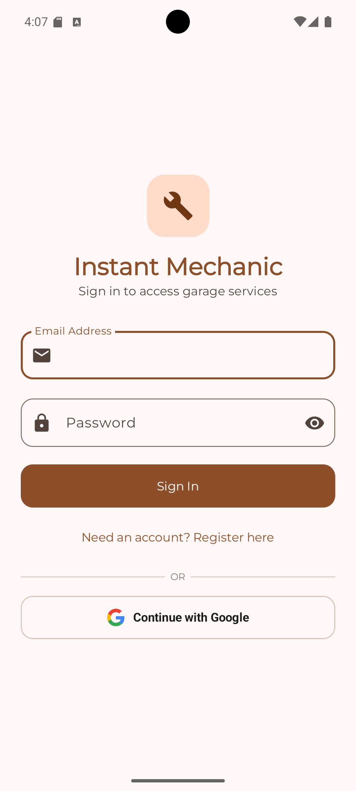
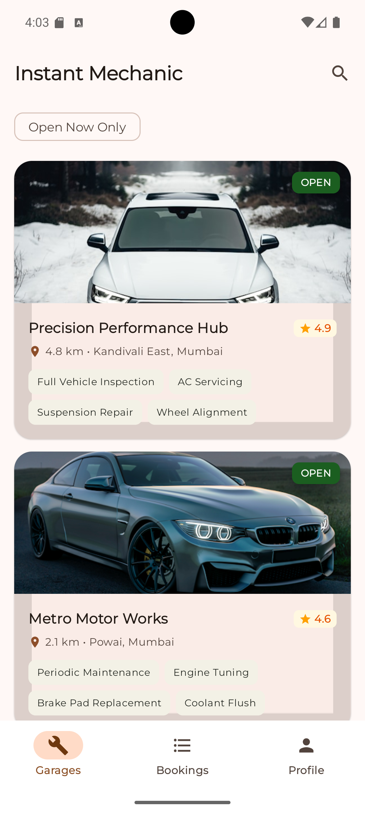
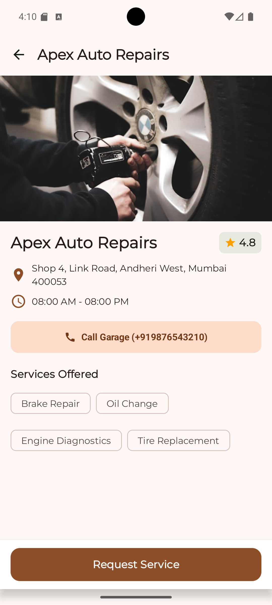
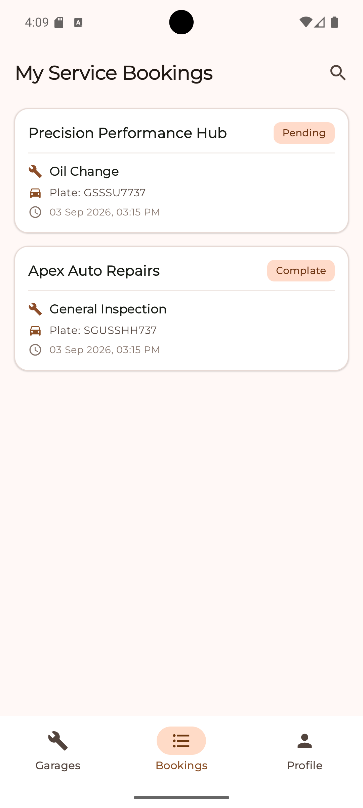

# 🛠️ Instant Mechanic

[](https://www.android.com)
[](https://kotlinlang.org)
[](https://developer.android.com/jetpack/compose)
[](https://developer.android.com/topic/architecture)
[](https://developer.android.com/training/data-storage/room)
[](https://firebase.google.com)

Instant Mechanic is an on-demand auto-repair and roadside service booking application developed for the Android Development Assignment. Built using **Jetpack Compose Material 3**, **Clean Architecture**, **MVI (Model-View-Intent)**, **Room Database**, **Retrofit**, and **Firebase (Auth & Cloud Firestore)**.

---

## 📱 App Walkthrough

| 🔐 Authentication | 🛠️ Garages Feed | 🔍 Garage Details | 📋 Real-Time Bookings |
| :---: | :---: | :---: | :---: |
|  |  |  |  |

---

## 🎯 Assignment Requirements Met

* **Home Screen:**
  * Garage listings with name, rating, distance, location, service chips, and dynamic open/closed badges.
  * Real-time search query filtering by workshop name, service, or area.
  * Instant "Open Now Only" filter chip toggle.
* **Mechanic Details:**
  * Full workshop banner loaded asynchronously via Coil 3.
  * Operating hours, address, and service tags.
  * Native dialer intent (`Intent.ACTION_DIAL`) to call the garage directly.
  * Persistent "Request Service" action button.
* **Request Service Form:**
  * Validated input fields: Full Name, 10-digit mobile number regex validation, vehicle plate formatting, and problem description.
  * Required Material 3 **Select Service** dropdown menu.
  * Confirmation dialog and instant Cloud Firestore synchronization.
* **Data Layer & Offline-First Caching:**
  * REST API integration fetching a 50-item JSON catalog hosted on GitHub Gist.
  * Single Source of Truth (SSOT) pattern: Room Database caches network data to ensure immediate offline availability.
* **Production Extras:**
  * Firebase Auth supporting Email/Password and One-Tap Google Sign-In.
  * Real-time Firestore snapshot listener (`callbackFlow`) powering the user's booking history.
  * Dynamic Light / Dark / System theme switcher with Montserrat Google typography.

---

## 🏛️ Architecture & MVI Data Flow

The project follows Clean Architecture separated into `presentation`, `domain`, `data`, and `core` layers, utilizing Unidirectional Data Flow (MVI):

```
┌────────────────────────────────────────────────────────┐
│                   Jetpack Compose UI                   │
│         (HomeScreen, DetailsScreen, RequestScreen)     │
└───────────▲────────────────────────────────┬───────────┘
            │ Observes StateFlow             │ Dispatches User Intents
            │                                │ (e.g. Load, Filter, Search)
┌───────────┴────────────────────────────────▼───────────┐
│                      MVI ViewModel                     │
└───────────▲────────────────────────────────┬───────────┘
            │ Collects Result Flow           │ Executes UseCases
┌───────────┴────────────────────────────────▼───────────┐
│                    Domain Use Cases                    │
└───────────▲────────────────────────────────────────────┘
            │ Queries Single Source of Truth
┌───────────┴────────────────────────────────────────────┐
│                    MechanicRepository                  │
└───────────┬────────────────────────────────┬───────────┘
            │ 1. Fetch JSON                  │ 2. Save & Emit Cache
            ▼                                ▼
┌────────────────────────┐       ┌───────────────────────┐
│   Retrofit REST API    │       │     Room Database     │
│     (GitHub Gist)      │       │   (Local Persistence) │
└────────────────────────┘       └───────────────────────┘
```

---

## 🛠️ Tech Stack

* **UI:** Jetpack Compose, Material 3, Material Icons Extended
* **Architecture:** Clean Architecture + MVI + Unidirectional Data Flow (UDF)
* **Dependency Injection:** Dagger Hilt
* **Asynchronous Flow:** Kotlin Coroutines, StateFlow, Channel
* **Networking:** Retrofit 2, OkHttp 3, Kotlinx Serialization
* **Offline Storage:** Room Database with SQLite
* **Cloud Backend:** Firebase Authentication, Cloud Firestore
* **Image Loading:** Coil 3 Compose
* **Navigation:** Jetpack Navigation Compose

---

## 🚀 Setup & Execution

### Prerequisites
* Android Studio (Ladybug or Meerkat)
* JDK 17
* Android SDK 34 / 35
* Physical Android device or Emulator with Google Play Services

### Steps
1. **Clone the Repository:**
   ```bash
   git clone https://github.com/Deepak-4551819/instant_mechanic.git
   cd instant_mechanic
   ```

2. **Configure Firebase:**
   ```bash
   cp app/google-services.json.example app/google-services.json
   ```
   Insert your `google-services.json` from Firebase Console.

3. **Configure Strings & Web Client ID:**
   ```bash
   cp app/strings.xml.example app/src/main/res/values/strings.xml
   ```
   Insert your OAuth Web Client ID in `strings.xml`.

4. **Build & Run:**
   ```bash
   ./gradlew :app:assembleDebug
   ```
